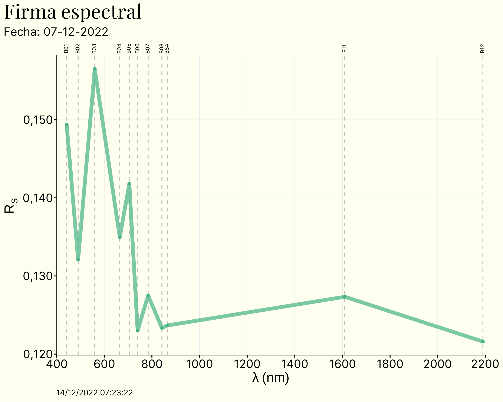

<link rel="preconnect" href="https://fonts.googleapis.com">
<link rel="preconnect" href="https://fonts.gstatic.com" crossorigin>
<link href="https://fonts.googleapis.com/css2?family=Inter:wght@300&family=Lato&display=swap" rel="stylesheet">


```{r setup, include=FALSE} 
knitr::opts_chunk$set(warning = FALSE, message = FALSE) 
```

```{r echo = FALSE, message = FALSE}
library(lubridate)
```

```{css echo = FALSE}
.author, .title {
    display: none;
}

.main-container {
    max-width: 60%;
}

body {
    background-color: ivory;
    color: black;
    font-size: 1.2vw;
    font-family: "Inter", sans-serif;
}

```



:::: {.columns}

::: {.column width="70%"}
Última actualización realizada el `r format(now(tzone = "America/Argentina/Buenos_Aires"), "%d/%m/%Y %T")`  
Sitio web [desarrollado](`r rmarkdown::metadata$github_repo`){target="_blank"} por [Víctor Gauto](mailto:`r rmarkdown::metadata$email_address`){target="_blank"}
:::

::: {.column width="10%"}

:::

::: {.column width="20%"}

[](https://www.facebook.com/GISTAQ){fig-align="right" height=10% target="_blank"}

:::

::::