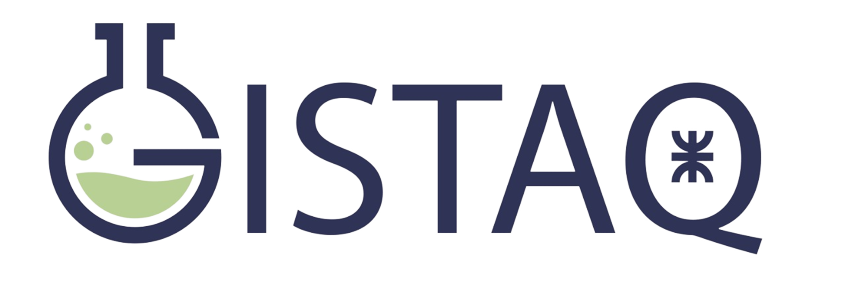

<link rel="preconnect" href="https://fonts.googleapis.com">
<link rel="preconnect" href="https://fonts.gstatic.com" crossorigin>
<link href="https://fonts.googleapis.com/css2?family=Inter:wght@300&family=Lato&display=swap" rel="stylesheet">


```{r setup, include=FALSE} 
knitr::opts_chunk$set(warning = FALSE, message = FALSE) 
```

```{css echo = FALSE}
.author, .title {
    display: none;
}

body {
    background-color: ivory;
    color: black;
    font-size: 1.2vw;
    font-family: "Inter", sans-serif;
}

```

```{r, echo=FALSE}
# librerías
library(raster)
library(leaflet)
library(htmltools)
library(leafem)
library(leaflet.extras)
library(lubridate)
library(glue)
library(tidyverse)

# stack ROI ---------------------------------------------------------------

recorte_stack <- raster::stack("recortes/recorte.tif")

# vector LR (irregular)
laguna_vector <- shapefile("vectores/roi_LR_mapa_turb4.shp")

# recorto
recorte_subset <- raster::mask(raster::crop(recorte_stack, laguna_vector),
                               laguna_vector)

# máscara de agua ---------------------------------------------------------
# MNDWI
# 10.3390/rs8040354
# (B03 - B11) / (B03 + B11)
# afecto por el factor de escala
b_b03 <- recorte_subset[[3]] / 10000 # algoritmo TURB & MNDWI
b_b05 <- recorte_subset[[5]] / 10000 # algoritmo TURB
b_b11 <- recorte_subset[[10]] / 10000 # MNDWI

recorte_mndwi <- (b_b03 - b_b11) / (b_b03 + b_b11)

# convierto a vector
mndwi_vector <- as.vector(recorte_mndwi)

# convierto NA en 100 (útil para usar k-means)
mndwi_vector2 <- mndwi_vector
mndwi_vector2[is.na(mndwi_vector2)] <- 100

# obtengo k-means, 3 centros (p/remover los valores 100, o sea, los NA)
k_laguna <- kmeans(x = mndwi_vector2, centers = 3)

# ordeno los center y elijo el index como cluster
clu <- match(sort(k_laguna$centers)[2], k_laguna$centers)

# convierto a ráster de 3 valores
knr <- recorte_mndwi
knr[] <- k_laguna$cluster

# agrego NA para valores de píxel 2 y 3
knr2 <- knr

# pongo NA en los píxeles que NO pertenecen al cluster
knr2[knr2 != clu] <- NA
# pongo 1 en donde haya agua, útil p/la mask de turb
knr2[knr2 == clu] <- 1

# algoritmo ---------------------------------------------------------------

# leo los datos
datos <- read_tsv("datos/turb_reflec_algoritmo.tsv")

# modelo lineal, interacción entre B05 & B03
mod_lin <- lm(formula = turb ~ I(B05*B03) + B03 + B05, data = datos)
sum_lin <- summary(mod_lin)
# R^2 = 0.9264183

# coeficientes
# fórmula: turb = a_0 + a_1 * B05 * B03 + a_2* B03 + a_3 * B05
a_0 <- sum_lin$coefficients[1, 1]
a_1 <- sum_lin$coefficients[2, 1]
a_2 <- sum_lin$coefficients[3, 1]
a_3 <- sum_lin$coefficients[4, 1]

# obtengo turb
laguna_turb <- a_0 + a_1 * b_b05 * b_b03 + a_2 * b_b03 + a_3 * b_b05

# aplico al raster de turb, la máscara de agua (mask_agua3)
turb_mapa <- laguna_turb * knr2

# mapa --------------------------------------------------------------------

# convierto mapa a LON-LAT
turb_mapa2 <- projectRaster(turb_mapa,
                            crs = CRS("+proj=longlat +datum=WGS84 +no_defs"))

# obtengo los valores más/mín de turb, p/asignar colores
color_max <- cellStats(turb_mapa2, stat = max)
color_min <- cellStats(turb_mapa2, stat = min)

# título del mapa (fecha)
fecha_ti <- read_tsv("datos/datos_nuevos2.tsv") |> pull(fecha) |> unique()
titulo <- tags$p(tags$style("p {color: black; font-size:22px}"),
                 tags$p(format(fecha_ti, format = "%d-%m-%Y")))

# paleta de colores
pal1 <- colorNumeric(palette = "RdBu", domain = values(turb_mapa2),
                    na.color = "transparent", reverse = TRUE)

mapa_t <- leaflet(width = "100%",
                  turb_mapa2,
                  options = leafletOptions(zoomControl = FALSE)) |>
    # capa Google Satellite
    addTiles(urlTemplate =
                 "http://mt0.google.com/vt/lyrs=s&hl=en&x={x}&y={y}&z={z}",
             attribution = "Google",
             group = "Google Satellite") |>
    # capa Google Maps
    addTiles(urlTemplate =
                "http://mt0.google.com/vt/lyrs=m&hl=en&x={x}&y={y}&z={z}",
             attribution = "Google",
             group = "Google Maps") |>
    # turbidez
    addRasterImage(turb_mapa2,
                   colors = pal1,
                   group = "Turbidez",
                   layerId = "Turbidez") |>
    # # control de las capas
    addLayersControl(
        baseGroups = c("Google Satellite", "Google Maps"),
        overlayGroups = "Turbidez",
        options = layersControlOptions(collapsed = FALSE)) |>
    # agrego título
    addControl(titulo, position = "topleft") |>
    # botón p/restablecer la vista
    addResetMapButton() |>
    # agrego logo GISTAQ
    addLogo(img = "https://i.imgur.com/HYpDORC.png",
            src = "remote",
            alpha = 1,
            position = "bottomleft",
            width = 200,
            height = 200 * 295 / 845) |>
    # leyenda
    addLegend(pal = pal1, values = values(turb_mapa2),
              title = "Turbidez (NTU)", opacity = 1) |>
    # zoom
    setView(lng = -58.96487, lat = -27.42378, zoom = 18) |>
    # agrego los valores de turb
    addImageQuery(
        turb_mapa2,
        type = "mousemove",
        layerId = "Turbidez",
        digits = 1,
        prefix = "") |>
    # botón de pantalla completa
    addFullscreenControl()

# elimino recorte ráster
# unlink(list.files(path = "recortes", full.names = TRUE), recursive = TRUE)

```

# Mapa de turbidez en laguna La Ribera

```{r, width = 40, height = 30, echo=FALSE}
mapa_t
```

[Firma espectral](https://raw.githubusercontent.com/vhgauto/monitoreo/main/figuras/firma.png){target="_blank"}.

:::: {.columns}

::: {.column width="70%"}
Última actualización realizada el `r format(now(tzone = "America/Argentina/Buenos_Aires"), "%d/%m/%Y %T")`  
Sitio web [desarrollado](`r rmarkdown::metadata$github_repo`){target="_blank"} por [Víctor Gauto](mailto:`r rmarkdown::metadata$email_address`){target="_blank"}
:::

::: {.column width="10%"}

:::

::: {.column width="20%"}

[](https://www.facebook.com/GISTAQ){fig-align="right" height=10% target="_blank"}

:::

::::